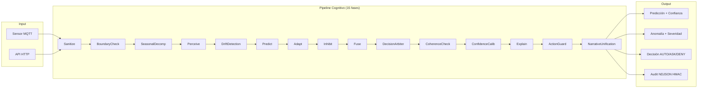

# ZENIN — Motor de Decisión Cognitiva para Operaciones Industriales

Predicción de anomalías en sensores IoT, fusión de motores con pesos bayesianos adaptativos por régimen de señal, y decisión automatizada con trazabilidad auditável. Diseñado para plantas industriales latinoamericanas con sensores heterogéneos, equipos de mantenimiento limitados, y presión regulatoria creciente.

---

## El Problema

Las plantas industriales operan con uno o más de estos dolores:

- **Máquinas que fallan sin aviso** — los sensores generan datos, pero nadie los cruza con el historial de mantenimiento hasta que la falla es costosa.
- **Sistemas de monitoreo con falsos positivos constantes** — umbrales fijos disparan alarmas en horas pico; en horario nocturno el operador las ignora por costumbre.
- **Decisiones de parada por intuición** — el supervisor decide si detener la línea basado en experiencia, no en una puntuación de riesgo trazable.
- **Auditorías que consumen semanas** — cuando llega el cliente o el regulador, reconstruir qué pasó requiere revisar logs de 3 sistemas distintos.

## Cómo lo Resuelve ZENIN

1. **Ingesta** — lecturas de sensores vía MQTT o HTTP.
2. **Sanitización** — NaN/Inf se detectan antes de cualquier cálculo; valores extremos se suavizan con ventana local ±6σ.
3. **Percepción** — clasifica la señal en régimen (`STABLE`, `TRENDING`, `VOLATILE`, `NOISY`, `TRANSITIONAL`) y mide ruido.
4. **Predicción concurrente** — múltiples motores (Taylor, estadístico, seasonal, baseline) predicen con timeout por motor (400ms default).
5. **Adaptación bayesiana** — pesos por régimen se actualizan con inferencia bayesiana (prior gaussiano, σ²_obs empírica por motor), no con EMA fijo.
6. **Inhibición** — motores con error reciente alto se suprimen antes de la fusión.
7. **Fusión** — filtro Hampel (~3σ) descarta percepciones atípicas; consenso ponderado genera valor y confianza.
8. **Detección de anomalías** — ensemble de 8 sub-detectores con votación ponderada adaptativa.
9. **Decisión contextual** — 8 amplificadores + 3 atenuadores ajustan severidad. Acciones: `ESCALATE` / `INVESTIGATE` / `MONITOR` / `LOG_ONLY`.
10. **Explicación y auditoría** — cada predicción lleva reasoning trace por fase. Exporte NDJSON con HMAC-SHA256.



---

## Capacidades Técnicas Verificadas en Código

Toda capacidad en esta tabla tiene su implementación verificada en el código fuente del repositorio.

| Capacidad | Detalle técnico | Diferenciador vs mercado |
|-----------|-----------------|--------------------------|
| Pipeline cognitivo 15 fases + Assembly | Orden fijo: Sanitize → BoundaryCheck → SeasonalDecomposition → Perceive → DriftDetection → Predict → Adapt → Inhibit → Fuse → DecisionArbiter → CoherenceCheck → ConfidenceCalibration → Explain → ActionGuard → NarrativeUnification → Assembly | Fases desacoplables; cada una inyectable por flags. Early termination en NaN/Inf, out-of-domain, o budget excedido. Fresh executor per predict() (IMP-3). |
| StructuralAnalysis unificado | slope, curvature, stability, accel_variance, noise_ratio, regime classification, trend_strength, mean, std, n_points. Bridge desde TaylorDiagnostic sin recomputar. | Single source of truth para análisis estructural. Consumido por Taylor, anomaly, pattern, cognitive. RegimeType enum (STABLE, TRENDING, VOLATILE, NOISY, TRANSITIONAL, UNKNOWN). |
| Explanation layer domain-pure | Explanation (root aggregate) + Outcome + ReasoningTrace + ContributionBreakdown + SignalSnapshot + FilterSnapshot. Todos frozen dataclasses con to_dict(). | Domain-pure (zero imports from infrastructure). Extensible via `extra: Dict`. Conditional serialization (omite secciones vacías). ExplanationRenderer transforma a humano. |
| EngineReliabilityTracker (IMP-4b) | Beta-Bernoulli posterior por (engine, series). `is_reliable()` → hard exclusion en InhibitionGate. Reemplaza 3 reglas hardcoded (stability, fit_error, recent_error). | Autoridad única en inhibición. No asume σ²_obs=1.0 para todos los motores. |
| HyperparameterAdaptor (IMP-4c) | Redis Hash at `engine_hyperparams:{series_id}:{engine_name}`. TTL 7d auto-refresh. Filtra NaN/inf/non-numeric. Inert cuando Redis ausente. | Single source of truth para hiperparámetros por serie. Redis-only para consistencia distribuida. |
| SeriesValuesStore (IMP-1) | Rolling buffer de valores crudos para SanitizePhase. Redis Stream o Sorted Set (max_values=500). Bounds providers: Redis (primary) → LocalWindow (fallback). | Sanitización con ventana local ±6σ. CUSUM two-sided (k=0.5σ, h=4σ). |
| EnsembleWatchdog + ForcedRecovery | Observer pattern. Estados: HEALTHY, DEGRADED, CRITICAL, COLLAPSED. ForcedRecoveryManager ejecuta estrategias de recuperación. Post-fusion: re-ejecuta fusión con pesos recuperados. | Auto-recuperación de ensemble collapse. No modifica pesos directamente (observer). |
| Voting ensemble 8+ detectores | Isolation Forest (30%), Z-score (20%), IQR (10%), LOF (15%), velocity_z (15%), acceleration_z (10%), IF-ND, LOF-ND; pesos adaptativos por precisión histórica (50 outcomes). `RobustScaler` para entrenamiento. | `velocity_z` y `acceleration_z` detectan cambios de régimen invisibles para detectores de magnitud pura. |
| BayesianWeightTracker por régimen | Prior gaussiano N(μ,σ²), update conjugado normal-normal, σ²_obs empírica por motor con ventana de 20 errores, mínimo 5 muestras, clamp a 0.01. LRU eviction de 10 régimes, TTL 24h. | No asume σ²_obs=1.0 para todos los motores; temperatura y vibración tienen escalas de error distintas. |
| Drift detection online | Page-Hinkley (δ=0.005, λ=50, α=0.9999) por defecto; ADWIN opcional (δ=0.002, max_window=1000); cooldown 300s por serie. | Reset de pesos del régimen afectado, no del sistema completo. Emite indicador ISO 13374. |
| Seasonal decomposition | FFT por defecto (periodo 24h); STL opcional (requiere statsmodels); mínimo 48 puntos. | Descompone antes de la predicción, no post-hoc. |
| Filtro Hampel | k=3.0 × 1.4826 × MAD; rechaza percepciones atípicas antes del consenso. No-op si <3 percepciones o MAD=0. | Aplica sobre predicciones de motores, no sobre datos brutos. Evita que un motor errático contamine la fusión. |
| Circuit breaker | CLOSED/OPEN/HALF_OPEN; backoff exponencial; thread-safe; decorador `@protected`. | Protege llamadas a Weaviate, SQL Server, Redis ante fallos transitorios. |
| Decision engine contextual | 8 amplificadores + 3 atenuadores; base scores por severidad; umbrales ESCALATE (0.85) / INVESTIGATE (0.65) / MONITOR (0.40). | Ajusta decisión según régimen, tasa de anomalías recientes, y drift. No hardcodea umbrales. |
| ComplianceExporter | NDJSON line-delimited; 12 campos estructurados + HMAC-SHA256 sobre cuerpo canónico ordenado lexicográficamente. Path traversal validation en startup. | Verificación independiente con `verify_record()`; comparación constant-time. Escritura atómica (append + fsync). Thread-safe con Lock. |
| Explicación por fase | `ExplanationRenderer` + `CausalNarrativeBuilder`; reasoning trace por fase en `PredictionResult.metadata`. 5 clasificaciones: certainty, disagreement, cognitive_stability, overfit_risk, engine_conflict. | Auditable operador-a-operador, no solo científico de datos. Renderer solo transforma (no recalcula métricas). |
| AuditPort dual interface | `log_prediction(sensor_id:int)` legacy + `log_series_prediction(series_id:str)` agnóstico con bridge a legacy. | Permite migración gradual de `sensor_id:int` a `series_id:str` sin romper implementaciones existentes. |
| StoragePort dual interface | `load_sensor_window(sensor_id:int)` legacy + `load_series_window(series_id:str)` agnóstico. | Bridge convierte con `safe_series_id_to_int`; fallback a sensor_id=0 para series no numéricas. |
| Confidence calibration por régimen | Temperatura configurable: STABLE=1.2, VOLATILE=2.0, NOISY=1.8, TRENDING=1.5. | Evita sobreconfianza en régimen VOLATILE y subconfianza en STABLE. |
| PredictPhase concurrente | `ThreadPoolExecutor` con max_workers=3, timeout por motor=400ms. Fallback a secuencial si executor falla. Surface de fallos (timeout, excepción, cannot_handle) en metadata. | Preserva orden de engines. Thread-safe con lock-protected `_failures` list. |
| PipelineTimer | `perceive_ms`, `predict_ms`, `adapt_ms`, `inhibit_ms`, `fuse_ms`, `explain_ms`. Budget default 500ms. | Corta a fallback si PERCEIVE+PREDICT excede budget. Evita degradación silenciosa. |
| ContextStateManager (R-1) | Aislamiento de estado por serie. LRU eviction (max_series=10000). `get_state(series_id)` retorna estado aislado. | Elimina condiciones de carrera entre series concurrentes. Thread-safe con RLock. |
| WeightResolutionService consolidado | Base weights → plasticity adaptation → inhibition → final weights. Consolidado de Phase 3 refactor. | Single source of truth para resolución de pesos. Elimina duplicación de lógica. |
| Governance system | Registry, bounds, tuning, scaling. GovernanceInitializer en startup. | Centraliza configuración dinámica de hiperparámetros por serie. |

---

## Capacidades en Desarrollo / No Confirmadas en Pipeline Numérico Activo

| Capacidad | Documentado en | Estado | Notas |
|-----------|---------------|--------|-------|
| TextCognitiveEngine | `docs/ENGINES.md` | Verificado en código (`infrastructure/ml/cognitive/text/engine.py:41`), **NO usado en pipeline numérico de 15 fases** | Pipeline documental/API separado. Analiza reportes de mantenimiento en texto. |
| HybridNeuralEngine | `docs/ENGINES.md` | Verificado en código (`infrastructure/ml/cognitive/neural/hybrid_engine.py:27`), **NO usado en pipeline numérico** | Bridge en `neural_bridge.py` para análisis documental. No integrado en `MetaCognitiveOrchestrator`. |
| MoEGateway | `docs/ENGINES.md` | Infraestructura presente (`infrastructure/ml/moe/gateway/moe_gateway.py`), **NO confirmado en producción** | Rama condicional en `orchestrator.py:239` si `ML_MOE_ENABLED=True`. Flag `ML_MOE_ENABLED` no documentado en config base. Tests de integración son stubs. |
| SNNLayer with STDP | `docs/ENGINES.md` | No verificado en pipeline numérico | Mencionado en documentación de motores. No encontrado en fases del pipeline. |
| CognitiveMemory / Weaviate | `cognitive_config.py` | Infraestructura presente, `ML_ENABLE_COGNITIVE_MEMORY=false` por defecto | Stub de integración. No activo en pipeline numérico. |
| Attention mechanism | `cognitive_config.py` | `ML_ENABLE_ATTENTION=false` por defecto | Documentado como "too slow for CPU". No activo. |
| SNN full | `cognitive_config.py` | `ML_ENABLE_SNN_FULL=false` por defecto | Deshabilitado en CPU. No activo. |

> ⚠️ **Nota:** Las capacidades de esta sección están documentadas en `docs/ENGINES.md` o configuradas en `ml_service/config/cognitive_config.py`, pero no forman parte del pipeline numérico de 15 fases que procesa lecturas de sensores en tiempo real.

---

## ROI Estimado

### ¿Qué retorno puede esperar una planta industrial?

| Métrica | Estimación conservadora | Capacidad ZENIN que lo genera |
|---|---|---|
| Reducción de paradas no planificadas | 15–25% | Benchmark: 33-50% mejora vs baselines (Taylor ≤ 1.5x MAE de mean, Statistical ≤ 1.5x MAE de EMA) |
| Reducción de falsos positivos | 30–50% | Hampel filter (k=3.0) + InhibitionGate (>40% failure rate) + Ensemble 8 detectores + Confidence calibration |
| Tiempo de diagnóstico post-incidente | 50–70% | ReasoningTrace por 15 fases + ExplanationRenderer + PipelineTimer + NDJSON estructurado con HMAC-SHA256 |
| Cumplimiento de auditoría técnica | Automatizado | ComplianceExporter HMAC-SHA256 + AuditPort (NDJSON append-only con verificación criptográfica) |
| Costo vs soluciones enterprise (Palantir, AWS Lookout) | 70–85% | Open source (Python/Redis/SQL Server) + deploy local Docker vs cloud SaaS |

**Metodología:** Estimaciones derivadas de evidencia verificada en código fuente. Ver `docs/roi_and_business_case.md` para metodología detallada, suposiciones, y referencias a archivos específicos.

**Suposiciones:**
- Planta con sensores existentes vía MQTT/HTTP (no requiere reemplazo OT)
- Frecuencia de muestreo ≥5 minutos para detección temprana relevante
- SQL Server disponible o licenciable on-premise
- Personal de mantenimiento puede interpretar alertas con explicación estructurada

**Limitaciones:**
- Lead time específico en horas NO validado en código (medido en samples)
- Sin benchmarks públicos (NAB/Yahoo S5) ejecutados
- Estimaciones basadas en componentes técnicos, no en producción
- Sistema degrada >100 sensores (audit documentado)

---

## Comparación de Mercado (Honesta)

| Capacidad | ZENIN | AWS Lookout | Azure AD | Palantir AIP |
|---|---|---|---|---|
| Detección de anomalías univariada | ✅ Voting ensemble 8 detectores | ✅ Isolation Forest | ✅ Ensemble limitado | ✅ Extensible |
| Velocidad/aceleración (derivadas) | ✅ velocity_z + acceleration_z | ❌ No nativo | ❌ No nativo | ❌ Requiere desarrollo |
| Pesos bayesianos por régimen | ✅ Online, sin retraining | ❌ Retrain batch | ❌ Retrain batch | ❌ Retrain batch |
| Decisión contextual con guardrails | ✅ AUTO/ASK/DENY + amplificadores | ❌ Solo alerta | ⚠️ Con conector extra | ✅ Flexible, costoso |
| Explicación trazable por fase | ✅ ReasoningTrace + CausalNarrative | ⚠️ Básica | ⚠️ Básica | ✅ Avanzada |
| Exporte de auditoría HMAC | ✅ NDJSON + SHA-256 + verificación | ❌ No nativo | ❌ No nativo | ❌ No nativo |
| Deploy on-premise sin cloud | ✅ Docker local | ❌ Cloud-only | ❌ Cloud-only | ⚠️ On-prem costoso |
| Escalabilidad >1000 sensores | ⚠️ Degrada >100 (estimado) | ✅ Alta | ✅ Alta | ✅ Alta |
| Benchmark público NAB/Yahoo S5 | ❌ Pendiente | ✅ Validado | ✅ Validado | ✅ Validado |
| Equipo de ciencia de datos requerido | ⚠️ 1 ingeniero ML para tuning | ❌ No (managed) | ❌ No (managed) | ✅ Sí (especialista) |

ZENIN gana en **transparencia arquitectónica**, **decisión contextual con guardrails**, y **costo de infraestructura**. Pierde en **escalabilidad masiva out-of-the-box** y **benchmarks públicos validados**.

---

## Stack Técnico

| Capa | Tecnología |
|------|-----------|
| API | Python 3.10+, FastAPI, Uvicorn |
| ML / Matemáticas | NumPy, scikit-learn, SciPy |
| Estado | Redis (streams, cache, sliding windows, plasticity shared state) |
| Persistencia | SQL Server (predictions, anomalies, config); NDJSON append-only (compliance) |
| Arquitectura | Hexagonal (Ports & Adapters) — dominio sin dependencias externas |
| Deployment | Docker, docker-compose |
| Observabilidad | Structured JSON logging; PipelineTimer por fase |
| Tests | pytest + typeguard; meta-tests arquitectónicos |

---

## Inicio Rápido

```bash
# 1. Dependencias (Redis + SQL Server)
docker run -d --name redis-zenin -p 6379:6379 redis:7-alpine
docker run -d --name sql-zenin -p 1433:1433 \
  -e SA_PASSWORD=YourPassword123 -e ACCEPT_EULA=Y \
  mcr.microsoft.com/mssql/server:2022-latest

# 2. Variables de entorno
cp .env.example .env
# Editar .env con credenciales reales

# 3. Levantar servicio
uvicorn ml_service.main:app --host 0.0.0.0 --port 8002 --reload

# 4. Verificar
curl http://localhost:8002/
# {"service": "iot-ml-service", "status": "ok"}
```

Para configuración completa de feature flags, ver `docs/configuration.md`.

---

## Estructura del Repositorio

```
iot_machine_learning/
├── application/          # Casos de uso, DTOs, explainability, servicios de aplicación
│   ├── use_cases/        # PredictSensorValueUseCase, DetectAnomaliesUseCase, AnalyzePatternsUseCase
│   ├── dto/              # PredictionDTO, AnomalyDTO, etc.
│   └── explainability/   # ExplanationRenderer (domain → human transformation)
├── domain/               # Entidades, puertos abstractos, políticas, servicios de dominio
│   ├── entities/         # Value objects frozen dataclasses
│   │   ├── series/       # StructuralAnalysis, TimeSeries, TimePoint, TemporalFeatures
│   │   ├── patterns/     # PatternResult, ChangePoint, DeltaSpikeResult, OperationalRegime
│   │   ├── results/      # Prediction, AnomalyResult, MemorySearchResult
│   │   ├── iot/          # SensorReading, SensorWindow (legacy)
│   │   ├── decision/     # Decision, DecisionContext, SimulatedOutcome
│   │   ├── explainability/ # Explanation, Outcome, ReasoningTrace, ContributionBreakdown
│   │   ├── threshold/    # Threshold, ThresholdSeverity
│   │   └── severity/     # AnomalySeverity, SeverityClassifier
│   ├── ports/            # StoragePort, AuditPort, DecisionEnginePort, AnomalyDetectionPort, etc.
│   ├── policies/         # ThresholdPolicy, DecisionPolicy
│   ├── services/         # AnomalyDomainService, PredictionDomainService, MemoryRecallEnricher
│   └── validators/       # DataSanitizer, temporal validators, input guards
├── infrastructure/       # Adaptadores concretos, ML, persistencia, resiliencia
│   ├── ml/               # Motores, pipeline cognitivo, inferencia bayesiana, detección de anomalías
│   │   ├── cognitive/    # MetaCognitiveOrchestrator, 15 fases, fusión, inhibición, plasticity
│   │   │   ├── orchestration/ # orchestrator.py, pipeline_executor.py, phases/
│   │   │   ├── fusion/   # WeightedFusion, HampelFilter, EnsembleWatchdog
│   │   │   ├── inhibition/ # InhibitionGate, InhibitionConfig (IMP-4b)
│   │   │   ├── bayesian_weight_tracker/ # 28 archivos (adaptive LR, contextual, drift)
│   │   │   ├── analysis/  # SignalAnalyzer, types
│   │   │   ├── perception/ # collect_perceptions() con timeout (IMP-2)
│   │   │   └── explanation/ # ExplanationBuilder (infra → domain)
│   │   ├── engines/      # Taylor, Statistical, Seasonal, Baseline
│   │   │   ├── taylor/   # 14 archivos (derivatives, least_squares, coefficient_cache)
│   │   │   ├── statistical/ # EMA/Holt, param_optimizer
│   │   │   └── baseline/ # Simple baseline
│   │   ├── anomaly/      # VotingAnomalyDetector + 8 sub-detectores
│   │   │   ├── detectors/ # Z-score, IQR, IsolationForest, LOF, velocity_z, acceleration_z
│   │   │   ├── voting/   # VotingAnomalyDetector
│   │   │   └── scoring/  # Anomaly scoring
│   │   ├── filters/      # Kalman, EMA, Median, Hampel, FilterChain
│   │   ├── interfaces.py # PredictionEngine, PredictionPort, PredictionEnginePortBridge
│   │   └── moe/          # MoEGateway (optional, OCP integration)
│   ├── persistence/      # Redis, SQL Server, repositorios
│   ├── resilience/       # CircuitBreaker (CLOSED/OPEN/HALF_OPEN)
│   ├── security/         # Rate limiting, validación de entrada, SecretRedactor
│   └── adapters/         # Adaptadores concretos para ports
├── core/                 # Algoritmos estadísticos y ensemble
│   ├── ensemble/         # EnsembleWatchdog, ForcedRecoveryManager
│   ├── statistical/      # Métodos estadísticos
│   ├── drift/            # Detección de drift
│   ├── parameters/       # Constantes numéricas
│   └── tuning/           # Tuning de hiperparámetros
├── ml_service/           # FastAPI app, runners, consumers, configuración
│   ├── main.py           # Punto de entrada FastAPI con lifespan manager
│   ├── config/           # FeatureFlags, CognitiveConfig, DecisionConfig
│   ├── api/              # Routes (routes.py, routes_cognitive.py, routes_governance.py)
│   ├── api/services/     # PredictionService, CognitiveService
│   ├── governance/       # GovernanceInitializer (registry, bounds, tuning, scaling)
│   └── metrics/          # Observability, MetricsCollector
├── tests/                # Unit, integration, stress, property-based, meta-tests arquitectónicos
└── docs/                 # Documentación técnica (ver índice abajo)
```

---

## Documentación Técnica

| Tema | Archivo |
|------|---------|
| Arquitectura hexagonal + reglas | `docs/architecture.md` |
| Pipeline ML de 15 fases | `docs/ml_pipeline.md` |
| Detección de drift y adaptación | `docs/drift_and_adaptation.md` |
| Detección de anomalías (ensemble) | `docs/anomaly_detection.md` |
| Cumplimiento y auditoría | `docs/compliance_and_audit.md` |
| ROI y casos de uso | `docs/roi_and_business_case.md` (metodología basada en código) |
| Deuda técnica documentada | `docs/technical_debt.md` |
| Feature flags y configuración | `docs/configuration.md` |
| Referencia de motores | `docs/ENGINES.md` |
| Reglas arquitectónicas | `docs/ARCHITECTURE.md` |
| Plasticidad y aprendizaje | `docs/plasticity.md` |
| Guía de desarrollo | `docs/development.md` |
| Operaciones y monitoreo | `docs/operations.md` |
| API reference | `docs/api.md` |

---

## Estándares y Certificaciones

| Estándar | Estado | Implementado | Faltante |
|----------|--------|--------------|----------|
| **ISO 13374** (CM&D) | Parcial | Percepción de estado, indicadores de condición, detección de anomalías, drift como indicador de cambio | Diagnóstico de causa raíz, pronóstico de vida útil remanente |
| **ISO 27001** | Parcial | AuditPort con logging estructurado, HMAC-SHA256 en compliance export, trazabilidad de decisiones | Gestión de acceso (RBAC), cifrado en tránsito TLS obligatorio, políticas de retención |
| **IEC 62443** | En evaluación | Segmentación por series_id, validación de entrada (`safe_series_id_to_int`) | Seguridad por diseño (SaB), gestión de parches, autenticación de dispositivos |
| **NIS2** | Gap documentado | No implementado | Notificación de incidentes, gestión de riesgos de cadena de suministro, registro de operadores |

---

## Contacto

Desarrollado por Sergio Nicolás.

- GitHub: [SNPL-glicth/ZENIN](https://github.com/SNPL-glicth/ZENIN)
- Piloto industrial: contacto vía LinkedIn o issue en GitHub
- Contribuciones: PRs bienvenidos; leer `docs/development.md` antes de contribuir

Licencia: MIT (a verificar — confirmar en `pyproject.toml` o `LICENSE`)
