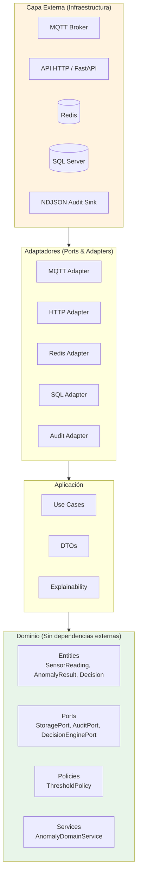
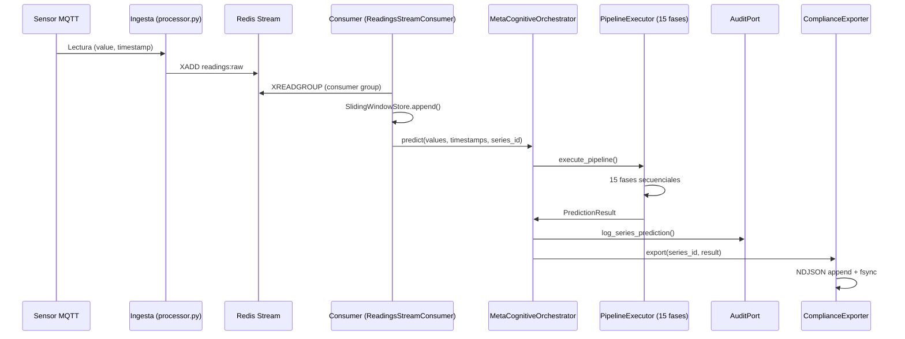

# Arquitectura ZENIN

**Última actualización:** 2026-05-04
**Aplica a:** `iot_machine_learning/` completo

---

## 1. Diagrama de Arquitectura Hexagonal



### Reglas de dependencia explícitas

```
ml_service/     → application/ → domain/
     ↑               ↑
infrastructure/ ────┘
```

- `domain/` **nunca** importa de `infrastructure/`, `application/`, o `ml_service/`.
- `application/` **nunca** importa de `infrastructure/` o `ml_service/`.
- `infrastructure/` importa de `domain/` (dirección correcta).
- `ml_service/` puede importar de cualquier capa interna.

### Violación conocida documentada

`ContextualDecisionEngine` en `infrastructure/ml/cognitive/decision/contextual_decision_engine.py` importa `FeatureFlags` desde `ml_service.config.flags`. Esto viola la regla de que `infrastructure/` no debe importar de `ml_service/`. Impacto: acoplamiento temporal entre decisión y configuración de servicio.

---

## 2. Pipeline Cognitivo Completo (15 Fases)

```mermaid
flowchart LR
    subgraph Phase0["Fase 0: Input"]
        IN[Raw values + timestamps]
    end

    subgraph Phase1["Fases 1–3: Pre-procesamiento"]
        P1[SanitizePhase<br/>NaN/Inf hard-stop, 6σ clamp, CUSUM]
        P2[BoundaryCheckPhase<br/>Validación de dominio]
        P3[SeasonalDecompositionPhase<br/>FFT/STL removal]
    end

    subgraph Phase2["Fases 4–5: Percepción + Drift"]
        P4[PerceivePhase<br/>Regime + noise_ratio + neighbor trends]
        P5[DriftDetectionPhase<br/>Page-Hinkley / ADWIN]
    end

    subgraph Phase3["Fases 6–9: Predicción + Fusión"]
        P6[PredictPhase<br/>Motores concurrentes con timeout]
        P7[AdaptPhase<br/>Resolución de pesos bayesianos]
        P8[InhibitPhase<br/>Supresión por error reciente]
        P9[FusePhase<br/>Hampel filter + WeightedFusion]
    end

    subgraph Phase4["Fases 10–14: Decisión + Validación"]
        P10[DecisionArbiterPhase<br/>Arbitraje de decisión]
        P11[CoherenceCheckPhase<br/>Validación de coherencia]
        P12[ConfidenceCalibrationPhase<br/>Calibración de confianza]
        P13[ExplainPhase<br/>ExplanationRenderer + CausalNarrative]
        P14[ActionGuardPhase<br/>Guardrails AUTO/ASK/DENY]
        P15[NarrativeUnificationPhase<br/>Narrativa unificada]
    end

    subgraph Assembly["Ensamblaje Final"]
        A[AssemblyPhase<br/>PredictionResult + ComplianceExport]
    end

    IN --> P1 --> P2 --> P3 --> P4 --> P5 --> P6 --> P7 --> P8 --> P9 --> P10 --> P11 --> P12 --> P13 --> P14 --> P15 --> A
```



### Early Termination Points

| Condición | Fase que dispara | Resultado |
|-----------|-----------------|-----------|
| NaN/Inf en datos | SanitizePhase | Fallback sanitizado con metadatos |
| Out-of-domain | BoundaryCheckPhase | Fallback con early result |
| Budget excedido | PredictPhase | Fallback a media móvil |
| Fallback general | Cualquier fase | Resultado parcial con diagnostic |

---

## 3. Flujo de Datos: Sensor → Decisión → Audit



---

## 4. Decisiones Arquitectónicas y Justificación

### ¿Por qué arquitectura hexagonal?

**Testabilidad:** `AnomalyDomainService` se prueba con `NullAuditLogger` y `InMemoryStorageAdapter` sin tocar Redis ni SQL Server. **Reemplazabilidad:** cambiar SQL Server por PostgreSQL requiere solo un nuevo adaptador que implemente `StoragePort`.

### ¿Por qué pipeline inmutable (`PipelineContext` frozen)?

Cada fase retorna un `PipelineContext` nuevo (no muta el anterior). Esto permite:
- Reproducibilidad: el contexto inicial + fases = resultado determinista.
- Paralelismo seguro: múltiples pipelines concurrentes sin condiciones de carrera.
- Debugging: el contexto de cualquier fase es inspectable sin side effects.

### ¿Por qué voting ensemble y no un solo modelo?

Los sensores industriales exhiben múltiples modos de falla: spikes de magnitud (Z-score), cambios de régimen (velocity_z/acceleration_z), outliers contextuales (LOF), y patrones multivariados (IF-ND). Ningún detector individual captura todos. El ensemble vota con pesos adaptativos; motores que fallan en un régimen se inhiben automáticamente.

### ¿Por qué BayesianWeightTracker y no pesos fijos o EMA simple?

Los pesos fijos asumen que un motor siempre es mejor. La EMA simple olvida que un motor puede ser excelente en STABLE pero terrible en VOLATILE. El tracker bayesiano mantiene un prior gaussiano por par `(regime, engine)`. Cada predicción actualiza el posterior con varianza empírica por motor (`σ²_obs` estimada online). Resultado: pesos óptimos por régimen, sin retraining.

---

## 5. Límites de Dependencia por Capa

```
domain/entities/ ──► nada (puro value objects)
domain/ports/    ──► domain/entities/
domain/services/ ──► domain/ports/, domain/entities/
domain/policies/ ──► domain/entities/
application/     ──► domain/
infrastructure/    ──► domain/, application/
ml_service/        ──► infrastructure/, application/, domain/
```

**Violación documentada:** `contextual_decision_engine.py` importa `ml_service.config.flags.FeatureFlags`. Severidad: media. ETA: migrar a `domain/` o inyectar por constructor.
