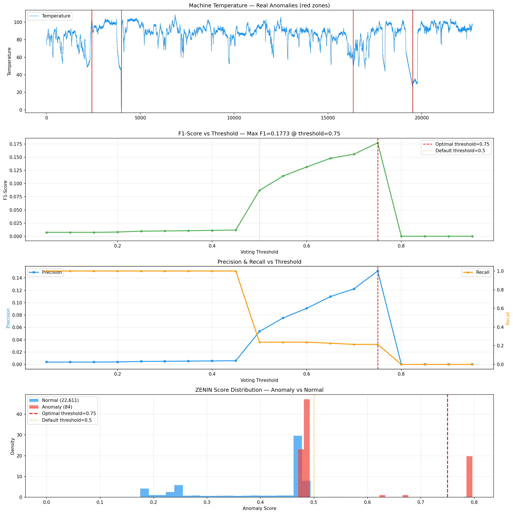

# infrastructure/ml/anomaly

Detección de anomalías mediante ensemble de sub-detectores con voting ponderado.

**Reorganizada:** 2026-03-20

## Package Structure

### 📁 core/
Core orchestration and configuration (3 files)
- `detector.py` (242 lines) — `VotingAnomalyDetector` main ensemble orchestrator
- `protocol.py` (160 lines) — `SubDetector` ABC + `DetectorRegistry` + `@register_detector`
- `config.py` (57 lines) — `AnomalyDetectorConfig` frozen dataclass

### 📁 scoring/
Statistical scoring and training utilities (4 files)
- `functions.py` (138 lines) — Pure scoring: `compute_z_score`, `compute_z_vote`, `weighted_vote`, etc.
- `training.py` (53 lines) — `TrainingStats` + `compute_training_stats()`
- `temporal.py` (117 lines) — `TemporalTrainingStats` + `compute_temporal_training_stats()`
- `statistical_methods.py` (38 lines) — **Backward-compat facade** re-exporting from above

### 📁 voting/
Voting strategy and context building (2 files)
- `strategy.py` (73 lines) — `VotingStrategy` class (weighted voting)
- `context_builder.py` (110 lines) — `build_vote_context()`, `extract_vel_z()`, `extract_acc_z()`

### 📁 factory/
Detector ensemble factory (1 file)
- `defaults.py` (78 lines) — `create_default_detectors()` builds 8-detector ensemble

### 📁 narration/
Human-readable explanation generation (1 file)
- `builder.py` (76 lines) — `build_anomaly_explanation()` text generation

### 📁 detectors/
Individual sub-detectors (5 files, unchanged)
- `z_score_detector.py`, `iqr_detector.py`, `isolation_forest_detector.py`, `lof_detector.py`, `temporal_z_detector.py`

## Sub-detectores (`detectors/`)

| Detector | Tipo | Descripción |
|---|---|---|
| `ZScoreDetector` | Magnitud | Z-score sobre distribución histórica |
| `IQRDetector` | Magnitud | Rango intercuartílico |
| `IsolationForestDetector` | Magnitud | Isolation Forest 1D |
| `LOFDetector` | Magnitud | Local Outlier Factor 1D |
| `VelocityZDetector` | Temporal | Z-score de velocidad (Δvalue/Δt) |
| `AccelerationZDetector` | Temporal | Z-score de aceleración (Δvelocity/Δt) |
| `IsolationForestNDDetector` | Temporal | Isolation Forest 3D [value, vel, acc] |
| `LOFNDDetector` | Temporal | LOF 3D [value, vel, acc] |

## Arquitectura

```
VotingAnomalyDetector.detect(window)
  ├── build_vote_context(window, temporal_stats)
  │     ├── temporal_features (si hay datos temporales)
  │     └── nd_features [value, vel, acc] (si window.size >= 3)
  ├── SubDetector[].vote(value, **ctx)  → Dict[str, float]
  ├── VotingStrategy.combine(votes)     → score final
  └── build_anomaly_explanation(votes, z, vel_z, acc_z)
```

## Folder Structure

```
anomaly/
├── __init__.py                    ← Public API (backward compatible)
├── README.md
├── core/                          ← Core orchestration
│   ├── detector.py                ← VotingAnomalyDetector
│   ├── protocol.py                ← SubDetector ABC + registry
│   └── config.py                  ← AnomalyDetectorConfig
├── scoring/                       ← Scoring & statistics
│   ├── functions.py               ← Pure scoring functions
│   ├── training.py                ← TrainingStats
│   ├── temporal.py                ← TemporalTrainingStats
│   └── statistical_methods.py    ← Backward-compat facade
├── voting/                        ← Voting logic
│   ├── strategy.py                ← VotingStrategy
│   └── context_builder.py         ← Context builders
├── factory/                       ← Factory
│   └── defaults.py                ← create_default_detectors
├── narration/                     ← Explanation
│   └── builder.py                 ← build_anomaly_explanation
└── detectors/                     ← Sub-detectors (unchanged)
    ├── z_score_detector.py
    ├── iqr_detector.py
    ├── isolation_forest_detector.py
    ├── lof_detector.py
    └── temporal_z_detector.py
```

## Import Examples

```python
# Public API (unchanged - backward compatible)
from infrastructure.ml.anomaly import (
    VotingAnomalyDetector,
    AnomalyDetectorConfig,
    SubDetector,
    DetectorRegistry,
    register_detector,
    VotingStrategy,
    create_default_detectors,
)

# Subpackage imports (new paths)
from infrastructure.ml.anomaly.core import VotingAnomalyDetector, AnomalyDetectorConfig
from infrastructure.ml.anomaly.scoring import compute_z_score, TrainingStats
from infrastructure.ml.anomaly.voting import VotingStrategy
from infrastructure.ml.anomaly.factory import create_default_detectors
```

## Extensibilidad (DI)

```python
# Inyectar detectores custom
from infrastructure.ml.anomaly import create_default_detectors, VotingAnomalyDetector

custom = create_default_detectors(config) + [MyCustomDetector()]
detector = VotingAnomalyDetector(sub_detectors=custom)

# Registrar detector nuevo
from infrastructure.ml.anomaly import register_detector

@register_detector("my_detector")
def create_my_detector(config):
    return MyCustomDetector(config)
```

## Pesos por defecto

| Detector | Peso |
|---|---|
| IsolationForest | 0.30 |
| Z-Score | 0.20 |
| VelocityZ | 0.15 |
| LOF | 0.15 |
| IQR | 0.10 |
| AccelerationZ | 0.10 |

## Benchmark NAB — Machine Temperature

Resultados del ensemble sobre el dataset `machine_temperature_system_failure` de NAB (22,695 puntos, 84 anomalías).

### Tuning de Threshold

Grid search sobre thresholds 0.05–0.95 para encontrar el punto óptimo de precision/recall:



### Resultados (post-fixes)

| Configuración | F1 | Precision | Recall | FP | FN |
|---|---|---|---|---|---|
| ZENIN tuned (optimal) 🏆 | 0.1773 | 0.1513 | 0.2143 | 101 | 66 |
| ZENIN default (0.5) | 0.0871 | 0.0533 | 0.2381 | 355 | 64 |
| Z-Score (global) | 0.1538 | 0.0909 | 0.5000 | 420 | 42 |
| IQR (global) | 0.0529 | 0.0274 | 0.7500 | 2235 | 21 |
